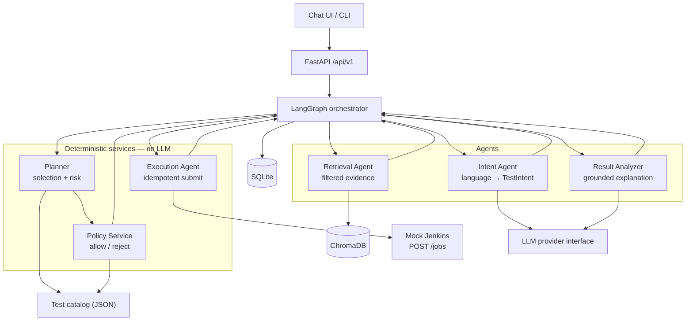
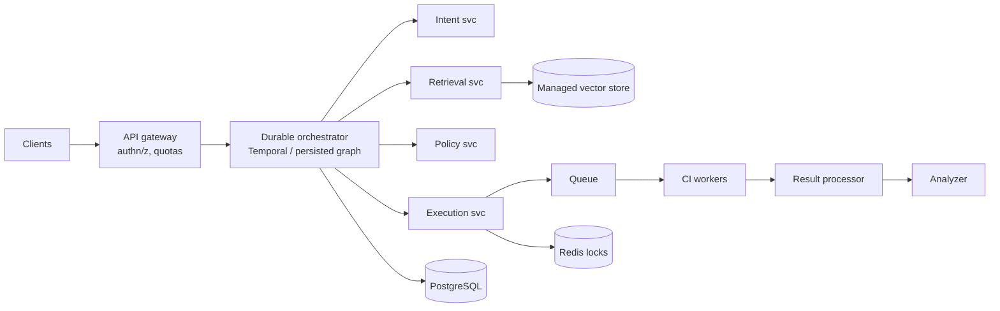

# Test Trigger — Architecture

A natural-language testing request becomes a policy-validated, executed,
evidence-grounded workflow. This document covers how the agents connect, how
data flows, why each component was chosen, and how it would scale.

Deeper material lives in [`docs/`](docs/): [architecture](docs/architecture.md),
[workflow lifecycle](docs/workflow.md), [data model](docs/data-model.md),
[API contract](docs/api-contract.md).

---

## 1. The organising idea

The system is built around one rule:

> **The LLM interprets language and explains results. It never authorises
> anything.**

Test selection, compatibility, policy, and status transitions are deterministic
code over trusted data. The model handles the two jobs it is genuinely good at —
turning a sentence into structure, and turning results into prose — and is
excluded from every decision that could run the wrong thing.

Everything below follows from that. It is also why the deterministic core runs
with no API key at all: the model is additive, not load-bearing.

---

## 2. How the agents connect



Agents never call each other. Each returns a validated slice of shared state,
and the graph decides what runs next. All routing lives in one file
(`app/orchestration/graph.py`), so every terminal outcome is visible in one
place rather than scattered through agent code.

| Component | Owns | Must not own |
| --- | --- | --- |
| Intent Agent | Structured interpretation of the query | Test selection, execution |
| Retrieval Agent | Filtered, attributed evidence | Authorising a plan |
| Planner | Candidate selection, ordering, risk score | Bypassing catalog constraints |
| Policy Service | Deterministic allow/reject + violations | Free-form model judgement |
| Execution Agent | Idempotent hand-off of a validated plan | Choosing tests |
| Result Analyzer | Grounded explanation, fallback summary | Inventing a root cause |
| LangGraph | Ordering, routing, terminal outcomes | Domain rules |

---

## 3. Data flow

```
"Run smoke tests for the payment module on Chrome in the US region"
   │
   ├─ 1. Intent      LLM + strict JSON schema → module/scope/browser/region
   │                 unsupported or missing → NEEDS_CLARIFICATION (no guess)
   │
   ├─ 2. Retrieval   catalog filter FIRST → compatible test IDs
   │                 → ChromaDB semantic search WITHIN that subset
   │                 → grouped, source-attributed, context-bounded evidence
   │
   ├─ 3. Plan        catalog-only selection, explainable risk score,
   │                 near-miss exclusions recorded with reasons
   │
   ├─ 4. Policy      unknown ID · empty plan · module/scope mismatch ·
   │                 browser/region · jurisdiction rules → allow or reject
   │
   ├─ 5. Execute     idempotency key = hash(workflow, exactly what would run)
   │                 → mock Jenkins QUEUED → RUNNING → COMPLETED
   │
   └─ 6. Analyse     LLM explains results from supplied evidence only,
                     then grounding is VERIFIED before the report is shown
```

Every step writes an audit record and a timeline event to SQLite, so a finished
workflow can be reconstructed without re-running it.

**Dry run** diverges only after step 4, so what it reports is exactly what would
have executed.

### Two places the design refuses to guess

**Retrieval filters before it ranks.** The catalog produces the set of tests
actually runnable under this intent; that set becomes the vector-store `where`
clause. Semantic similarity only ranks an already-legal candidate set, so a
Chrome/US request cannot surface a Safari-only test as evidence — regardless of
how similar the text is. A vector-store failure raises rather than returning an
empty list, because "no evidence" and "evidence unavailable" must never look
alike.

**Analysis grounding is verified, not requested.** The prompt asks the model to
cite evidence; the code then checks it independently. A report is discarded — in
favour of a deterministic summary of observed facts — if it cites a source that
was never supplied, blames a test that never ran, or blames a test that passed.
Prompting reduces hallucination; this makes an ungrounded claim structurally
unable to reach the user.

---

## 4. Why each component

| Choice | Reason | Cost accepted |
| --- | --- | --- |
| **FastAPI** | Typed, small, automatic OpenAPI; routes stay thin adapters | — |
| **LangGraph** | Makes state, conditional routing, and failure paths first-class instead of hiding them in a long function | A dependency for a graph that is currently small |
| **ChromaDB** | Local, zero-ops semantic search, adequate for a demo corpus | Not a scale answer |
| **SQLite** | Durable, inspectable, no server; the audit trail matters more than throughput | Single-writer |
| **OpenAI behind a provider interface** | Structured output via JSON schema; the interface keeps agents vendor-agnostic and makes tests offline | Cost, latency, availability |
| **Deterministic services** | Policy must be explainable and repeatable | More code than "ask the model" |
| **Buildless frontend** | One page, no bundler, no npm; the container is three files | No component framework |

Two constraints shaped the LLM boundary specifically:

- **Structured output is schema-constrained**, and the schema is generated from
  the same enums the validators use — so the prompt contract cannot drift from
  the vocabulary the catalog accepts.
- **Output is validated twice**: schema first, then a normalization layer that
  maps approved synonyms (`Google Chrome` → `chrome`) and returns `None` for
  anything unknown rather than snapping to the nearest match.

---

## 5. Failure behaviour

| Failure | Response | Result |
| --- | --- | --- |
| Unclear request | Ask for the missing fields, naming supported values | `NEEDS_CLARIFICATION`, 422 |
| Provider outage during intent | Typed clarification, never a guessed intent | `NEEDS_CLARIFICATION`, 422 |
| Vector store down | Stop rather than plan blind | `RETRIEVAL_FAILED`, 424 |
| No matching tests / jurisdiction rule | Reject with structured violation codes | `REJECTED`, 422 |
| CI job fails | Keep the validated plan and the execution record | `EXECUTION_FAILED`, 503 |
| **LLM analysis fails** | **Deterministic summary of observed facts** | **`COMPLETED`** |

The last row is the important one: an analysis outage degrades the explanation
but never hides the results, and the workflow still completes. A rejected or
failed workflow still returns its ID and stays fully inspectable through
`GET /api/v1/workflows/{id}`.

---

## 6. Scaling to production

The current shape is a modular monolith — one deployment, strict internal
seams. Those seams are where it splits.



| Concern | Now | Production | Why it moves |
| --- | --- | --- | --- |
| Execution | Synchronous | Queue + workers, webhook callbacks | Real suites run for minutes; the API must acknowledge immediately |
| State | SQLite | PostgreSQL | Concurrent writers, backups, retention |
| Orchestration | In-process LangGraph | Durable orchestrator with checkpoints | A crash must not lose an in-flight workflow |
| Retrieval | Local ChromaDB | Managed vector store, per-tenant namespaces | Corpus size, isolation, availability |
| CI | Mock Jenkins | Real provider behind the same adapter | Only the adapter changes; the contract is already there |
| LLM | Direct provider | Gateway: quotas, caching, prompt registry, model routing | Cost control and A/B on prompt versions |
| Identity | None | AuthN/Z, per-team policy scoping | Who may run what, where |
| Observability | Structured JSON logs | OpenTelemetry traces, spans per agent | Correlate a slow workflow across services |

**What does not change:** the catalog stays the only source of executable test
IDs, policy stays deterministic, evidence stays retrieved-and-bounded, and
analysis grounding stays verified. Those are correctness properties, not
scaling ones.

**Ordering of work, if this were real:** durable orchestration and async
execution first (correctness under failure), then Postgres, then the LLM
gateway (cost), then multi-tenancy. Managed vector search last — it is the
least likely to be the bottleneck.

---

## 7. What proves it works

423 automated tests, ~13 seconds, no live paid provider required — the LLM
boundary is always a recorded payload or a typed error.

- **Unit** — models, catalog, policy, risk scoring, repositories, normalization
- **Integration** — real ChromaDB, real SQLite, real mock CI at every boundary
- **End-to-end** — success, unsupported browser, empty plan, CI failure, LLM
  fallback, ungrounded analysis, dry run, idempotent replay
- **Browser** — real Chromium against mocked API responses
- **Evaluation** (`uv run python scripts/evaluate.py`) — intent field accuracy
  8/8, retrieval filter correctness 5/5, Hit@5 1.0, Recall@5 1.0, grounded
  analysis 4/4. Two of the four analysis cases are *negative*: an invented test
  and an uncited source, both correctly refused.
- **Secret hygiene** — the repository is scanned for committed credentials on
  every run

The system has also been run end to end against a live OpenAI key in Docker,
with state surviving a container restart.

---

## 8. Known limits

Deliberate, given the scope: no real browser automation (execution is a seeded
simulator), no authentication or tenancy, local-only UI, a 12-test catalog with
24 knowledge-base documents, and SQLite plus local ChromaDB. The optional
code-analysis agent is specified in
[`docs/modules/12-optional-code-analysis.md`](docs/modules/12-optional-code-analysis.md)
but not implemented.
