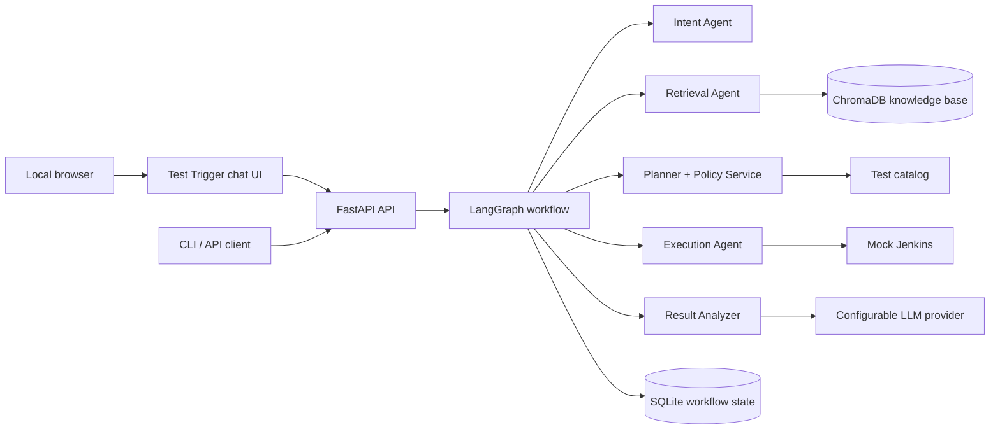

# Test Trigger

An AI-assisted test orchestration platform that converts a natural-language testing request into an evidence-backed, policy-validated, executable test workflow, then explains the results with grounded AI. A focused, local-only web chat interface gives an interviewer or developer one place to submit and inspect a workflow.

> **Project status:** documentation and architecture are complete; application implementation is the next phase. API endpoints, commands, and integrations described below are target contracts—not runnable software yet.

## Why this project exists

Running a test suite usually requires knowing the exact suite name, supported browser and region, relevant policy constraints, and the execution system. This project provides a controlled natural-language interface over that work. For example:

```text
Run smoke tests for the payment module on Chrome in the US region.
```

The system will extract structured intent, retrieve evidence, choose only catalogued tests, validate deterministic policies, launch a mock CI job, collect results, and produce an evidence-grounded report.

## Design principles

- Use an LLM for language understanding and evidence-based explanation, not deterministic authorization or validation.
- Retrieve external evidence before an LLM makes an evidence-dependent decision.
- Treat the test catalog as the sole source of executable test IDs.
- Persist workflow state and agent activity so every material decision is inspectable.
- Keep module boundaries clear while delivering a simple, local modular monolith.

## Target architecture



## Planned technology choices

| Concern | Target choice | Purpose |
| --- | --- | --- |
| API | FastAPI | Typed, lightweight HTTP interface and automatic OpenAPI documentation. |
| Web UI | Local browser chat client | A deliberately small conversational interface for workflow submission and inspection. |
| Workflow | LangGraph | Explicit, stateful orchestration with conditional failure paths. |
| AI and embeddings | OpenAI API via a provider interface | Uses a backend-only API key for structured intent, grounded analysis, and embeddings. |
| Retrieval | ChromaDB | Local vector search over test documentation, history, and rules. |
| Durable state | SQLite | Auditable local workflow, execution, and result history. |
| Validation | Pydantic + deterministic services | Enforces trusted schemas and business rules. |
| CI integration | Mock Jenkins service | Demonstrates external execution safely and repeatably. |
| Local runtime | Docker Compose | Starts the frontend and backend together on a local machine. |

## Documentation map

Start with [the documentation index](docs/README.md). The core documents are:

- [Module map and story inventory](docs/module-map.md) — 11 MVP modules, their ownership, dependencies, and 59 planned stories.
- [Architecture](docs/architecture.md) — component boundaries, request lifecycle, reliability, and production evolution.
- [Workflow lifecycle](docs/workflow.md) — state machine, error paths, and dry-run behavior.
- [API contract](docs/api-contract.md) — target endpoints and response conventions.
- [Data model](docs/data-model.md) — catalog, retrieval evidence, and SQLite records.
- [Module documentation](docs/modules/) — detailed responsibility, stories, interfaces, and acceptance criteria for each module.

## MVP scope

The MVP covers the end-to-end workflow: intent, retrieval, planning, policy validation, mock execution, result collection, grounded analysis, persistence, API/CLI access, a local chat UI, and a local Docker runtime. The story inventory totals **59 MVP stories**. A code-analysis agent is documented as a **4-story optional extension** and is intentionally not required for the first working path.

## Planned repository layout

```text
app/
  api/                 # FastAPI routes and request/response adapters
  agents/              # Intent, retrieval, execution, and analysis agents
  orchestration/       # LangGraph graph and shared workflow state
  services/            # Planner, policy, retrieval, execution, analysis
  models/              # Pydantic domain contracts
  db/                  # SQLite setup and repositories
  llm/                 # Provider abstraction and versioned prompts
frontend/              # Local-only chat interface; consumes the FastAPI API
  Dockerfile            # Frontend image definition
knowledge_base/        # Test docs, historical failures, jurisdiction rules
data/                  # Versioned test catalog and seed data
scripts/               # Knowledge-base ingestion
tests/                 # Unit, integration, and end-to-end tests
docs/                  # Project documentation
Dockerfile             # Backend image definition
docker-compose.yml     # Local frontend + backend runtime
```

## Future local setup (after implementation)

The implementation will provide a `pyproject.toml` or `requirements.txt`, `.env.example`, seed data, Dockerfiles, `docker-compose.yml`, and concrete commands. The expected local flow is:

1. Create a Python virtual environment and install project dependencies.
2. Copy `.env.example` to `.env` and set the OpenAI API key used by the backend for LLM requests and embeddings.
3. Seed SQLite and ingest `knowledge_base/` into ChromaDB.
4. Start the backend and local web UI together with Docker Compose, or run the backend directly for API-only development.

Until implementation begins, review [the architecture](docs/architecture.md) and [the module story map](docs/module-map.md) rather than attempting to run commands that do not exist yet.

## Planned local configuration

| Variable | Used by | Purpose |
| --- | --- | --- |
| `OPENAI_API_KEY` | Backend only | Authorizes OpenAI model and embedding requests. Never expose it to the browser or commit it. |
| `OPENAI_MODEL` | Backend | Selects the structured-intent and result-analysis model. |
| `OPENAI_EMBEDDING_MODEL` | Backend ingestion/retrieval | Selects the embedding model for the local ChromaDB collection. |
| `DATABASE_URL` | Backend | Points to the local SQLite database. |
| `CHROMA_PERSIST_DIRECTORY` | Backend | Location of local ChromaDB data. |
| `FRONTEND_ORIGIN` | Backend | Local browser origin allowed by CORS. |

Docker Compose receives `OPENAI_API_KEY` from the local environment or `.env` file and passes it only to the backend container. It must not be baked into an image, sent in a frontend build argument, or placed in browser-accessible configuration.

## Planned Docker run

After the implementation adds the compose files, one local command will start the frontend and backend:

```bash
docker compose up --build
```

The browser will open the local Test Trigger chat UI; it will call the local FastAPI service. This MVP is deliberately not hosted or deployed to a public environment.

## Target API example

```http
POST /api/v1/workflows
Content-Type: application/json

{
  "query": "Run smoke tests for the payment module on Chrome in the US region",
  "dry_run": false
}
```

```json
{
  "workflow_id": "WF-1001",
  "status": "completed",
  "summary": "Executed 4 payment smoke tests. 3 passed and 1 failed.",
  "execution_id": "JOB-2001"
}
```

The full contract, including error responses and lifecycle inspection, is defined in [docs/api-contract.md](docs/api-contract.md).

## Delivery sequence

The project is intentionally built in dependency order: foundation and data, retrieval, mock execution, intent, planning and policy, orchestration, result analysis, API, local chat UI, local Docker runtime, then quality evaluation. See [the module map](docs/module-map.md) for the exact story order and [the architecture](docs/architecture.md) for the rationale.

## Known MVP limits

- No real browser automation or Jenkins deployment.
- No production authentication, tenancy, distributed workers, or public hosting.
- The chat interface runs only on the local machine and is intentionally limited to the interview workflow.
- Small, mock knowledge base and test catalog.
- SQLite and local ChromaDB are development-focused choices.
- LLM analysis is additive: a deterministic summary remains available when the provider fails.

The intended production evolution is documented in [Architecture: production evolution](docs/architecture.md#production-evolution).
