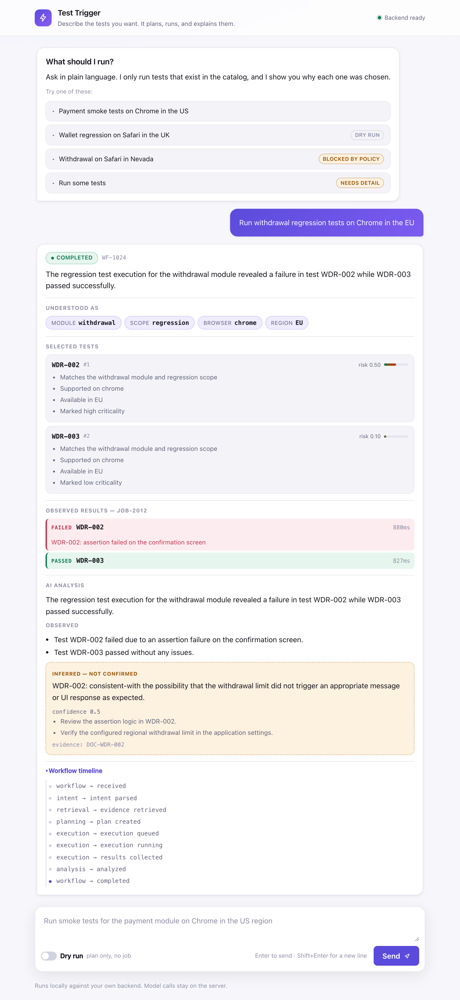
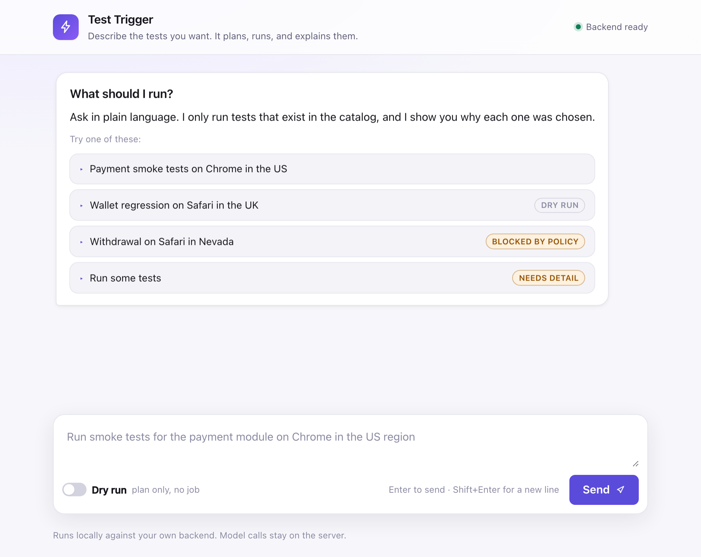
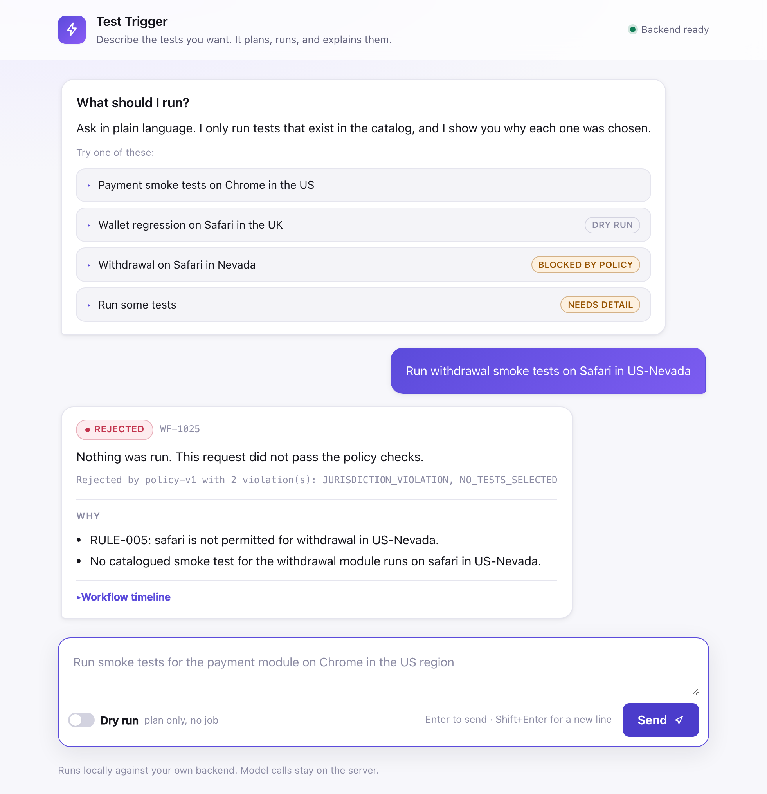
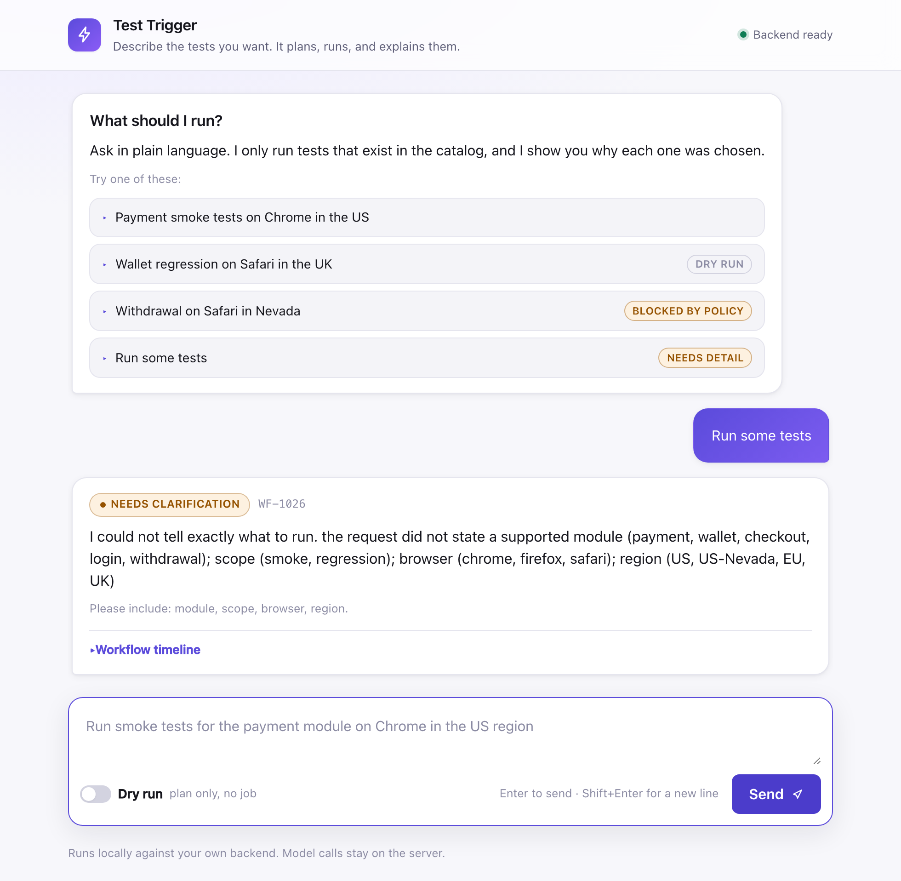
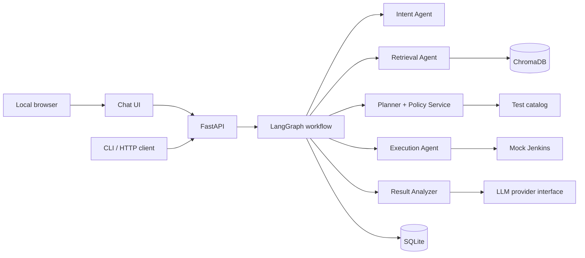

# Test Trigger

An AI-assisted test orchestration platform that converts a natural-language testing request into an evidence-backed, policy-validated, executable test workflow, then explains the results with grounded AI. A focused, local-only web chat interface gives an interviewer or developer one place to submit and inspect a workflow.

```text
Run smoke tests for the payment module on Chrome in the US region.
```

The system extracts structured intent, retrieves evidence, selects only catalogued tests, validates deterministic policy, launches a mock CI job, collects results, and produces an evidence-grounded report.

> **Status:** the 59-story MVP is implemented and tested. It is a local interview project, not a hosted or production service.

## What it looks like

The chat UI shows every stage: what the request was understood as, which tests were selected and why, what actually happened, and what the AI inferred from it.



Observed results and AI inference are deliberately never styled the same. A failure is a fact; a cause is a hypothesis, labelled **Inferred — not confirmed** and required to cite the evidence it used.

<table>
<tr>
<td width="50%"></td>
<td width="50%"></td>
</tr>
<tr>
<td><b>Start here.</b> Example prompts fill the composer so you can see the phrasing before running anything.</td>
<td><b>Policy blocks it.</b> Safari is not certified for Nevada, so nothing runs and <code>RULE-005</code> is cited.</td>
</tr>
</table>



**A vague request is never guessed at.** It asks for the missing fields and names every supported value.

## Quick start

```bash
cp .env.example .env      # set OPENAI_API_KEY
docker compose up --build
```

| Address | What |
| --- | --- |
| http://localhost:5173 | Chat UI |
| http://localhost:8000 | API |
| http://localhost:8000/docs | Interactive OpenAPI |
| http://localhost:8000/jobs | Mock Jenkins (simulated CI) |

Both services bind to `127.0.0.1` only. Reset all local state with `docker compose down -v`.

**Without an API key the system still runs.** Intent extraction and AI analysis switch off, `/health` reports which features are disabled, and the deterministic core — catalog, policy, execution, persistence — keeps working. That is by design, not a fallback bolted on afterwards.

### Running from source

```bash
uv sync --extra dev
uv run python scripts/ingest_knowledge_base.py     # needs OPENAI_API_KEY
uv run uvicorn app.api.main:build --factory --reload
```

The UI is then served at `/` and the API under `/api/v1`.

### Command-line client

```bash
uv run python scripts/client.py run "Run payment smoke tests on Chrome in US"
uv run python scripts/client.py run "..." --dry-run
uv run python scripts/client.py show WF-1001
uv run python scripts/client.py events WF-1001
uv run python scripts/client.py health
```

Copyable `curl` equivalents for every scenario are in [docs/api-examples.md](docs/api-examples.md).

## Demo scenarios

| Request | Outcome |
| --- | --- |
| `Run smoke tests for the payment module on Chrome in the US region` | Executes, then explains the results |
| `Run payment smoke tests on Chrome in US` with dry run | Plans and validates, starts no job |
| `Run some tests` | Asks for the missing fields instead of guessing |
| `Run login smoke tests on Chrome in Nevada` | Rejected: no catalogued test matches |
| `Run withdrawal smoke tests on Safari in US-Nevada` | Rejected: jurisdiction rule blocks Safari |

## Design principles

These are the point of the project, and the tests enforce them:

1. **The LLM never authorizes anything.** It interprets language and explains results. Selection, policy, and status transitions are deterministic code.
2. **Executable test IDs come only from the catalog.** A model cannot introduce one.
3. **Retrieval precedes evidence-dependent reasoning**, and the response cites the source IDs it was given.
4. **Every decision is explainable.** Each selected test records why it was chosen and what its risk score was made of.
5. **State is durable.** Every material step writes an audit record and a timeline event.
6. **LLM failure never hides results.** Analysis degrades to observed facts and the workflow still completes.
7. **Grounding is verified, not requested.** An analysis citing unavailable evidence, or a failure for a test that passed, is discarded rather than shown.

## Architecture



A workflow moves through `RECEIVED → INTENT_PARSED → EVIDENCE_RETRIEVED → PLAN_CREATED →` execution `→ RESULTS_COLLECTED → ANALYZED | FALLBACK_SUMMARY → COMPLETED`, with terminal branches for clarification, retrieval failure, policy rejection, dry run, and execution failure. See [docs/workflow.md](docs/workflow.md).

## Repository layout

```text
app/
  api/            FastAPI routes, view assembly, error mapping
  agents/         Intent, retrieval, execution, analysis
  orchestration/  LangGraph state, nodes, routing, runner
  services/       Planner, policy, risk scoring
  models/         Pydantic domain contracts
  db/             SQLite schema and repositories
  llm/            Provider interface and versioned prompts
  knowledge/      Knowledge-base documents, loader, ingestion
  retrieval/      Vector store
  integrations/   Mock Jenkins
  observability/  Structured logging
  evaluation/     Evaluation harness
frontend/         Buildless chat client
knowledge_base/   Test docs, historical failures, jurisdiction rules
data/             Versioned test catalog
evaluation/       Labelled evaluation dataset
scripts/          Ingestion, example client, evaluation
tests/            unit, e2e, evaluation, frontend
docs/             Architecture and module documentation
```

## Testing

```bash
uv run pytest                      # everything
uv run pytest tests/unit           # fast isolated logic
uv run pytest tests/e2e            # full paths through the API
uv run pytest tests/evaluation     # quality thresholds
uv run pytest tests/frontend       # real Chromium, mocked API
uv run pytest -k policy            # by name
```

No test requires a live paid provider: the LLM boundary is always replaced with a recorded payload or a typed error. Frontend tests need Chromium (`uv run playwright install chromium`) and skip when it is absent.

## Evaluation

```bash
uv run python scripts/evaluate.py
```

Reports intent field accuracy, retrieval filter correctness, Hit@K and Recall@K, and a grounded-analysis review over a small labelled set in `evaluation/dataset.json`. It is deliberately small and manually reviewable — evidence of engineering judgement, not a claim of statistical model validation. The same thresholds are asserted in `tests/evaluation/`.

## Configuration

| Variable | Used by | Purpose |
| --- | --- | --- |
| `OPENAI_API_KEY` | Backend only | Model and embedding requests. Never exposed to the browser. |
| `OPENAI_MODEL` | Backend | Intent and analysis model. |
| `OPENAI_EMBEDDING_MODEL` | Backend | Embedding model for ChromaDB. |
| `DATABASE_URL` | Backend | Local SQLite path. Use `sqlite:////abs/path` for an absolute path. |
| `CHROMA_PERSIST_DIRECTORY` | Backend | Local ChromaDB data. |
| `FRONTEND_ORIGIN` | Backend | Browser origin allowed by CORS. |
| `API_BASE_URL` | Frontend container | The only value the browser receives. |
| `INTENT_CONFIDENCE_THRESHOLD` | Backend | Below this, a request asks for clarification. |
| `LLM_TIMEOUT_SECONDS` | Backend | Provider request timeout. |

`.env` is git-ignored; `.env.example` lists names without values. A key is never written into an image layer, a frontend build argument, a log, an API response, or a database row — and `tests/unit/test_secret_hygiene.py` checks the repository for committed credentials on every run.

## Documentation

- **[Architecture](ARCHITECTURE.md)** — agents, data flow, component rationale, scaling. Start here.
- [Documentation index](docs/README.md)
- [Architecture](docs/architecture.md) — boundaries, data flow, failure handling, production evolution
- [Module map](docs/module-map.md) — 11 MVP modules and the 59-story breakdown
- [Workflow lifecycle](docs/workflow.md) — state machine and invariants
- [API contract](docs/api-contract.md) and [API examples](docs/api-examples.md)
- [Data model](docs/data-model.md)
- [Assumptions and trade-offs](docs/assumptions-and-tradeoffs.md)

## Known limits

- No real browser automation or Jenkins deployment; execution is a seeded simulator.
- No authentication, tenancy, distributed workers, or public hosting.
- The chat UI is local-only and intentionally limited to this workflow.
- Small synthetic knowledge base and catalog (12 tests, 24 documents).
- SQLite and local ChromaDB are development choices.
- A code-analysis agent is documented as an optional 4-story extension and is not implemented.

The intended production path is documented in [Architecture: production evolution](docs/architecture.md#production-evolution).
