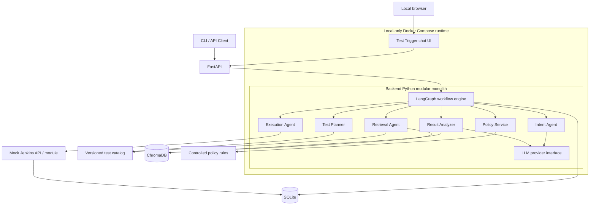
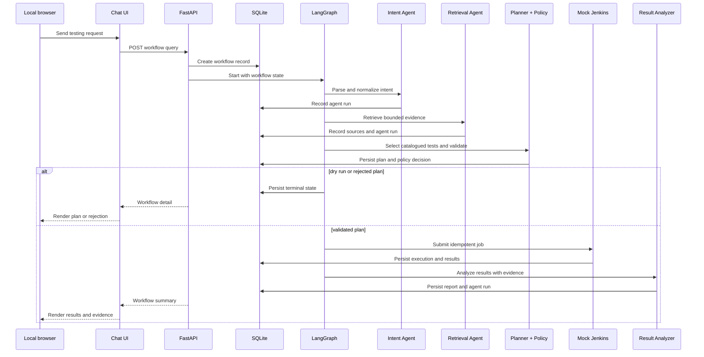
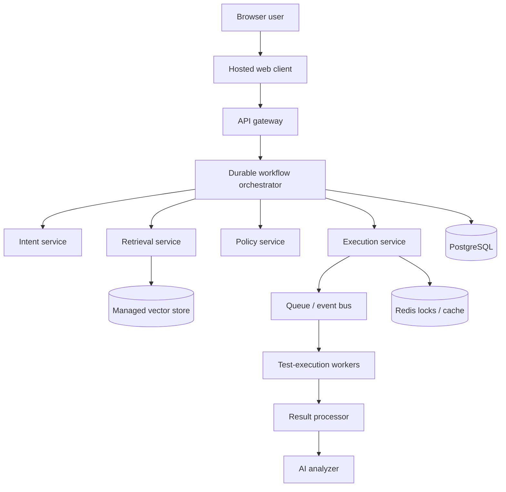

# Architecture

## Problem

The platform makes test execution accessible through natural language without delegating safety-critical decisions to a language model. It translates a request into a validated execution plan, derives that plan from known catalog data and retrieved evidence, runs it through a mock CI service, and records an explainable result.

## Architectural style

The MVP is a **modular monolith**: one Python deployment and one source repository, with strict internal interfaces. This minimizes operational cost for a take-home project while preserving seams for later extraction into independent services.

## System context

## Component responsibilities

| Component | Owns | Must not own |
| --- | --- | --- |
| Local web chat UI | User query input, workflow conversation rendering, dry-run toggle, API presentation state | API key handling, LLM calls, policy, or workflow decisions |
| FastAPI | HTTP validation, status codes, route-level request IDs | Planning, policy, or agent logic |
| LangGraph | Workflow state, ordering, routing, and terminal outcomes | Domain rules or vector-store query semantics |
| Intent Agent | Structured interpretation and normalization of a query | Test selection or execution |
| Retrieval Agent | Evidence queries, metadata filters, source attribution | Authorizing a plan |
| Planner | Candidate selection, ordering, risk score, selection reasons | Bypassing catalog constraints |
| Policy Service | Deterministic validation and rejection details | Free-form LLM judgment |
| Execution Agent | Idempotent hand-off of a validated plan | Choosing tests or analyzing failures |
| Mock Jenkins | Job lifecycle and repeatable simulated results | Workflow-level decision-making |
| Result Analyzer | Evidence-grounded explanation and fallback summary | Declaring invented root causes |
| SQLite repositories | Durable workflow and audit data | Business policy |
| Docker Compose | Local frontend/backend service wiring, volumes, environment injection, and startup dependencies | Deployment, public hosting, or embedded credentials |

## Request lifecycle

## Trust boundaries and deterministic controls

The test catalog, policy rules, workflow state, execution results, and controlled vocabulary are trusted application data. Browser input, LLM output, and external service responses are untrusted inputs until validated.

Critical safeguards:

- Pydantic validates all API, agent, and integration payloads.
- Only catalog IDs may enter an execution plan.
- Policy checks run in deterministic code after planning and before execution.
- Retrieval returns document/source IDs and bounded context; the analyzer cites that evidence in its structured response.
- Status changes follow a controlled workflow transition table, never an LLM instruction.
- An idempotency key prevents a client retry from starting a duplicate job.
- The OpenAI API key is read by the backend only. The browser receives neither the key nor a proxy endpoint that permits arbitrary model/embedding requests.

## Data ownership

| Data | Source of truth | Primary consumers |
| --- | --- | --- |
| Test catalog | Versioned seed file / catalog repository | Retrieval, planner, policy |
| Knowledge documents and embeddings | `knowledge_base/` + ChromaDB | Retrieval, analysis |
| Workflow and agent runs | SQLite | API, orchestration, observability |
| Plans and executions | SQLite | Execution, workflow inspection |
| Test results | Mock Jenkins response persisted in SQLite | Analyzer, API |
| Prompts and provider configuration | Version-controlled modules + environment configuration | Intent, analysis |
| Chat presentation state | Local browser memory | Local web UI only; workflow data remains in FastAPI/SQLite |

## Failure handling

| Failure | Workflow response | Persisted outcome |
| --- | --- | --- |
| Missing or invalid intent | Request clarification; do not plan or execute | `NEEDS_CLARIFICATION` with parsing details |
| Retrieval failure | Retry only if transient; otherwise fail safely | `RETRIEVAL_FAILED` and source/error context |
| No matching tests or policy violation | Block execution with structured explanation | `REJECTED` and policy violations |
| Mock Jenkins failure | Do not lose validated plan; allow later inspection/retry | `EXECUTION_FAILED` with external error |
| LLM timeout or malformed analysis | Return deterministic result summary | completed execution plus `FALLBACK_SUMMARY` analysis status |
| Local UI unavailable | API remains usable through CLI or HTTP client | No workflow data is lost; UI displays a connection error when restored |

See [workflow.md](workflow.md) for the state machine.

## Why these technologies

- **FastAPI** is small, typed, testable, and automatically documents the HTTP contract.
- **A local web chat UI** gives the interview project a focused, visual product surface without adding a complex frontend workflow engine.
- **LangGraph** makes state, conditional routing, and failure paths first-class rather than hiding them in a long function.
- **ChromaDB** gives a local, inexpensive semantic-retrieval implementation suitable for a small demo corpus.
- **SQLite** provides durable, inspectable local state without operating a database server.
- **OpenAI API access through a backend provider interface** supplies structured intent, grounded analysis, and embeddings while keeping keys out of the client. The interface preserves a future provider seam.
- **Docker Compose** makes the frontend and backend reproducible with one local command; it is a local development/interview runtime, not a hosting architecture.

## Production evolution

The move is evolutionary: the local web UI becomes a separately hosted client; FastAPI becomes stateless and horizontally scalable; SQLite becomes PostgreSQL; the mock CI interface becomes a queue-backed integration; ChromaDB becomes a managed vector store only when scale warrants it. Prompt/version management, centralized LLM quotas, OpenTelemetry traces, authentication, authorization, secrets management, and tenant isolation become platform concerns.

## Architectural acceptance criteria

- Every workflow can be inspected after completion or failure.
- Execution only receives a policy-validated plan containing catalogued test IDs.
- Evidence-dependent LLM actions receive retrieved context with source identifiers.
- An unavailable LLM cannot hide execution results.
- Modules depend inward through contracts rather than importing route or database details directly.
- The local web UI can run with the backend through Docker Compose without receiving the OpenAI API key.
