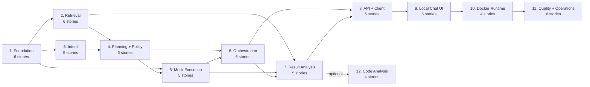

# Module Map and Story Inventory

The MVP is organized into eleven modules with explicit ownership. This avoids a collection of agents that overlap in responsibility and gives implementation a dependency-aware order.

## Summary

| # | Module | Primary responsibility | MVP stories | Depends on |
| --- | --- | --- | ---: | --- |
| 1 | [Foundation and Data](modules/01-foundation-and-data.md) | Define trusted models, catalog, configuration, and durable records. | 6 | — |
| 2 | [Knowledge Base and Retrieval](modules/02-knowledge-base-and-retrieval.md) | Ingest and retrieve bounded, attributable planning and analysis evidence. | 6 | 1 |
| 3 | [Intent Understanding](modules/03-intent-understanding.md) | Convert a request into validated, normalized `TestIntent`. | 5 | 1 |
| 4 | [Planning and Policy](modules/04-planning-and-policy.md) | Select known tests and deterministically validate a plan. | 6 | 1–3 |
| 5 | [Mock Execution](modules/05-mock-execution.md) | Simulate an idempotent external test job lifecycle. | 5 | 1, 4 |
| 6 | [Workflow Orchestration](modules/06-workflow-orchestration.md) | Coordinate the full stateful path and conditional outcomes. | 6 | 1–5 |
| 7 | [Result Analysis](modules/07-result-analysis.md) | Produce a grounded report with a deterministic fallback. | 5 | 1, 2, 5, 6 |
| 8 | [API and Client Interface](modules/08-api-and-client-interface.md) | Expose workflows, inspection, cancellation, and a sample client. | 5 | 1, 6, 7 |
| 9 | [Local Web Chat Interface](modules/09-local-web-chat-interface.md) | Provide a local browser chat experience over the FastAPI API. | 5 | 8 |
| 10 | [Local Container Runtime](modules/10-local-container-runtime.md) | Run the frontend and backend together with Docker Compose. | 4 | 1, 2, 5, 8, 9 |
| 11 | [Quality and Operations](modules/11-quality-and-operations.md) | Add tests, evaluation, logs, and local-operability safeguards. | 6 | 1–10 |
| 12 | [Optional Code Analysis](modules/12-optional-code-analysis.md) | Review submitted Python test files using facts plus AI explanation. | 4 | 1, 7, 8 |

**MVP total: 59 stories.**

**Optional extension total: 4 stories.**

## Delivery order

Modules 2 and 3 can be developed after the foundation in either order. The rest follow the dependency flow above. The local chat UI calls the API only; it does not call OpenAI or ChromaDB directly. Docker Compose is added after both application surfaces have a stable local contract.

## Story-accounting rules

- A story belongs to the module that owns its behaviour, even if another module invokes it.
- Shared models and persistence belong to Module 1; consumers should not redefine them.
- An LLM prompt alone is not a completed story. The story must validate output, expose errors, and have a testable acceptance criterion.
- The optional code-analysis module does not block the core natural-language-to-execution workflow.

## MVP slice

The earliest demonstrable vertical slice is: seeded catalog → normalized intent → deterministic selection and policy validation → seeded mock execution → persisted result → deterministic summary. Retrieval, LangGraph, and LLM analysis then enrich that working baseline rather than substitute for it.

For acceptance criteria and story detail, open the individual module guide linked from the summary table.
