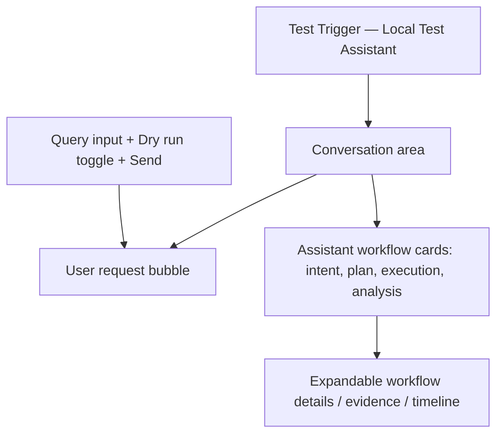

# Module 9 — Local Web Chat Interface

**Stories:** 5 MVP stories

**Owns:** the local browser-based chat experience, HTTP interaction with FastAPI, workflow rendering, local UI states, and browser-level usability checks.

**Depends on:** API and Client Interface.
**Used by:** interviewer and developer running Test Trigger locally.

## Purpose

Provide a deliberately small, polished web page for the interview task. The interface makes Test Trigger feel like a product while retaining the API as the single workflow entry point. It runs locally only and is not hosted.

## Interaction design

The initial UI has one primary journey:

1. A user enters a natural-language test request.
2. The chat sends `POST /api/v1/workflows` through the local backend.
3. A pending message communicates processing state.
4. The assistant response renders the workflow outcome: clarification, rejected plan, dry run, execution summary, or result analysis.
5. A user can open the workflow details/timeline to inspect the evidence-backed decisions.

## Stories

| ID | Story | Acceptance criterion |
| --- | --- | --- |
| WEB-1 | Build a local chat-page shell with accessible input, send action, and conversation history. | Keyboard users can enter, submit, and read a request/result exchange without a complex dashboard. |
| WEB-2 | Connect the chat submission to the workflow-create endpoint. | A valid request shows a pending state and then renders the returned workflow ID, status, and summary. |
| WEB-3 | Render structured workflow responses as readable assistant cards. | Intent, selected tests, policy result, execution outcome, analysis, and evidence/timeline are visible when returned. |
| WEB-4 | Support dry runs, clarification, rejection, and service-error states. | The user sees actionable, non-technical messages and can send a corrected request. |
| WEB-5 | Add browser-level tests and local usability safeguards. | Empty submission, loading state, API failure, and response rendering are verified without requiring a live OpenAI call. |

## UI constraints

- Local-only: no deployed URL, user accounts, shared sessions, or collaboration features.
- The UI is a browser client of FastAPI, never a direct client of OpenAI or ChromaDB.
- `OPENAI_API_KEY` must not appear in JavaScript bundles, frontend environment variables, browser storage, network payloads, or screenshots.
- Keep conversation state lightweight. Durable workflow history remains in SQLite and is retrieved through the API.
- Display the difference between observed test results and inferred AI analysis, including evidence/source references where available.

## Boundaries

The web client owns presentation and local interaction only. It must not reimplement intent parsing, test selection, policy validation, job polling, embedding creation, or any agent prompt.

## Tests

Use mocked local API responses to cover a happy path, a policy rejection, a clarification request, a dry run, a connection error, and accessible keyboard submission.
