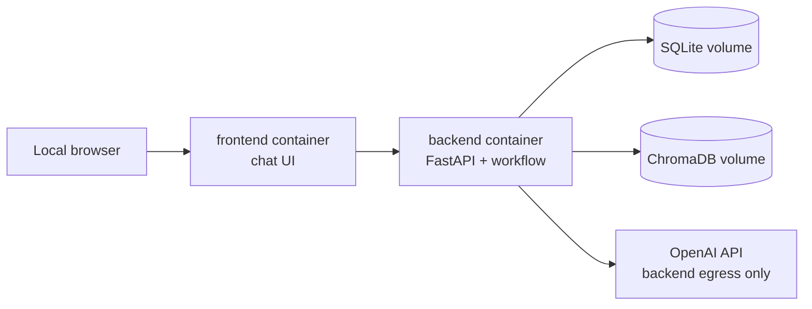

# Module 10 — Local Container Runtime

**Stories:** 4 MVP stories

**Owns:** backend and frontend container definitions, Docker Compose service wiring, local data volumes, environment injection, and the documented one-command startup path.

**Depends on:** Foundation and Data, Knowledge Base and Retrieval, Mock Execution, API and Client Interface, Local Web Chat Interface.
**Used by:** interviewer and developer running Test Trigger locally.

## Purpose

Make the full interview demo reproducible on a local machine. Docker Compose runs a frontend container and backend container together; it is not a public deployment, a Kubernetes design, or an image-distribution strategy.

## Target topology



The frontend receives only the local API base URL. The backend receives `OPENAI_API_KEY` at container runtime through the developer's local environment or ignored `.env` file.

## Stories

| ID | Story | Acceptance criterion |
| --- | --- | --- |
| CTR-1 | Create reproducible backend and frontend Dockerfiles. | Both images build from a clean checkout with production-like dependency installation and no embedded secrets. |
| CTR-2 | Define `docker-compose.yml` service wiring. | `docker compose up --build` starts the local frontend and backend on a private compose network with documented ports. |
| CTR-3 | Configure persistent local SQLite and ChromaDB volumes plus initialization. | Restarting containers preserves seeded/ingested demo state, with a documented reset path. |
| CTR-4 | Implement environment, health, and startup validation. | Missing OpenAI configuration gives a safe feature-status message; health checks distinguish frontend availability and backend readiness. |

## Runtime rules

- Bind services for local development only; the compose file must not claim to provide a public deployment.
- `.env` is ignored by Git. `.env.example` lists variable names without secrets.
- Do not copy API keys into an image layer, frontend build argument, static file, log, or Docker Compose output.
- The backend is the only container permitted to make model and embedding requests.
- Persistent data is mounted to named/local volumes, not buried in disposable containers.

## Target runbook

Once these implementation stories are complete:

```bash
cp .env.example .env
# Set OPENAI_API_KEY in .env
docker compose up --build
```

The user then opens the documented local frontend address and submits a workflow through the chat. The exact ports and reset command will be finalized with the compose file.

## Tests

Validate image builds, compose configuration, health endpoints, frontend-to-backend connectivity, volume persistence, and absence of secret values from generated images/configuration.
