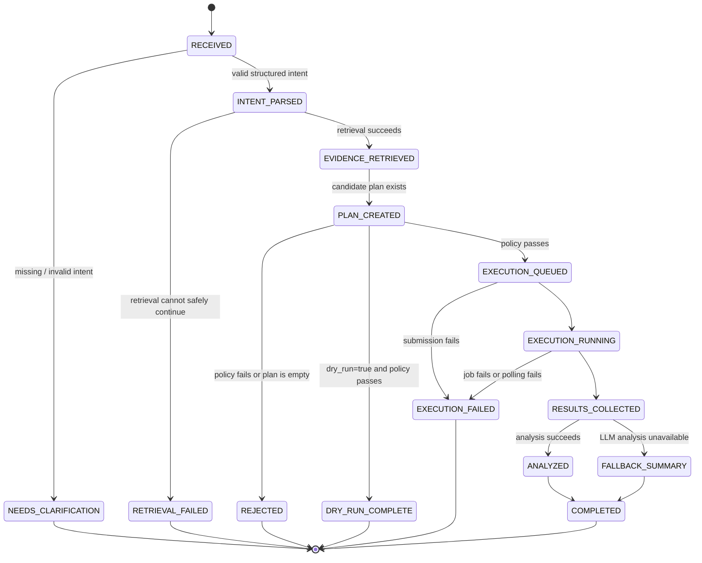

# Workflow Lifecycle

LangGraph orchestrates a stateful workflow. Individual agents and services return validated updates to a shared state; they do not call one another implicitly or mutate persistence records ad hoc.

The local web chat interface is a workflow client: it sends the natural-language request to FastAPI, then renders the returned workflow and event data as a conversation. It does not participate in graph state or access the LLM/embedding provider.

## Shared workflow state

```python
class TestWorkflowState(TypedDict):
    workflow_id: str
    user_query: str
    dry_run: bool
    intent: dict | None
    retrieved_context: dict | None
    test_plan: dict | None
    policy_result: dict | None
    execution_id: str | None
    execution_status: str | None
    execution_results: list[dict]
    analysis: dict | None
    errors: list[dict]
```

The persisted workflow record is the audit trail. LangGraph state is the current orchestration snapshot and must be reconstructible from persisted records if a future deployment supports resumption.

## State machine



## Node contract

| Node | Reads | Writes | Can route to |
| --- | --- | --- | --- |
| Create workflow | query, `dry_run` | workflow ID, `RECEIVED` record | Intent Agent |
| Intent Agent | query, vocabulary | validated `TestIntent`, agent run | Retrieval or clarification |
| Retrieval Agent | intent, retrieval configuration | grouped evidence and source IDs | Planner or retrieval failure |
| Planner | intent, catalog, evidence | candidate plan and explanations | Policy Service |
| Policy Service | candidate plan, catalog, rules | validation result / violations | execution, dry-run completion, or rejection |
| Execution Agent | validated plan, idempotency key | external job ID and execution record | result collection or execution failure |
| Result Collection | job ID | normalized test results | Result Analyzer |
| Result Analyzer | results, evidence, test docs | structured analysis or fallback | completed |

## Dry-run behavior

`dry_run=true` deliberately follows intent, retrieval, planning, and policy validation, then stops at `DRY_RUN_COMPLETE`. It must not create a job or test-result records. The response still includes the plan, selection reasons, policy outcome, and retrieved evidence identifiers so a user can inspect what would execute.

## Retry rules

- Retry only known transient infrastructure operations, such as a temporary vector-store or mock-CI transport failure.
- Do not retry a rejected plan, invalid intent, or unsupported browser/region.
- Use the original idempotency key when retrying job submission.
- Preserve every attempted agent run, error, and final transition in SQLite.
- An analysis retry may be attempted without re-running tests; if it still fails, create a deterministic fallback report.

## Approval extension

The MVP documents, but does not require, a `WAITING_FOR_APPROVAL` branch between policy validation and execution. A future rule can send high-risk plans there when `risk_score >= configured_threshold`. Only an explicit approval endpoint may transition it to `EXECUTION_QUEUED`; rejection is terminal.

## Invariants

1. A workflow ID exists before an agent begins.
2. Retrieval happens before evidence-dependent planning or analysis.
3. Test IDs in `test_plan` originate from the catalog.
4. No execution begins before policy validation passes.
5. Every terminal state has a user-readable summary and durable error or result context.
6. Current execution results survive analysis failure.
